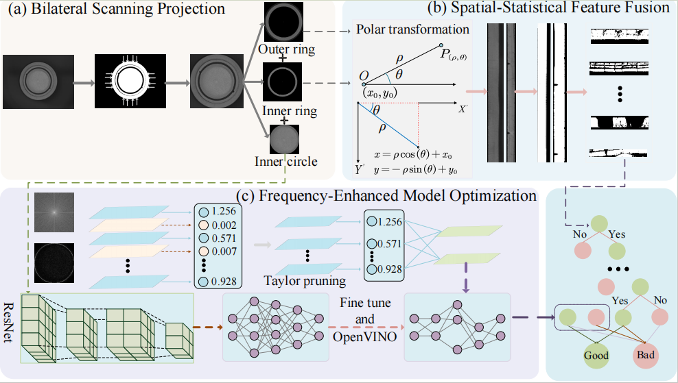

# MDFI
# Qt Battery Defect Detection

This repository contains a Qt-based C++ application for battery defect detection. The GUI and core logic are implemented in Qt Widgets, allowing rapid deployment on any platform with Qt support. It also provides the core code for our TCE journal paper, “Advancing Industrial Battery Defect Analysis via Multi‑Domain Feature Integration and Optimized Neural Pruning for Edge System.”


<p align="center">
  <a href="figure/overview.pdf">
    
  </a>
</p>


## Abstract
Automated battery defect detection is essential for ensuring quality and safety in consumer electronics manufacturing, enabling enhanced edge-level decision-making and operational efficiency. However, existing methods struggle to achieve both high accuracy and real-time performance required by edge-based industrial scenarios. This paper introduces a lightweight, multi-domain feature integration approach designed specifically for edge deployment, significantly enhancing the practical applicability of battery defect classification. Firstly, a bilateral scanning projection module is developed for precise and rapid battery localization, segmenting battery images efficiently into inner circle, inner ring, and outer ring regions. Subsequently, a spatial-statistical feature fusion module effectively captures structural defects in the spatial domain. To streamline feature extraction and ensure consistent classification accuracy, the annular regions undergo polar coordinate transformation, resulting in simplified geometric representation. Additionally, we propose a frequency-enhanced optimization strategy tailored for lightweight edge networks, utilizing Fast Fourier Transform and frequency filtering methods to accurately identify complex texture defects. To further meet real-time requirements and minimize computational overhead, we apply Taylor pruning techniques to optimize network performance, facilitating efficient deployment using the OpenVINO framework on edge devices. The proposed lightweight AI framework achieves a {classification} accuracy of 98.8\% while maintaining a rapid inference speed of 20ms per image, substantially outperforming current battery defect detection approaches and demonstrating significant potential for edge-enhanced decision-making in consumer electronics manufacturing. {Our code is available at \url{https://github.com/heng-shan/Battery}.}


## Project Structure
├── main.cpp # Application entry point

├── mainwindow.cpp # Main window implementation

├── mainwindow.h # Main window class definition

├── mainwindow.ui # Qt Designer UI file

├── mythread.cpp # Background thread implementation

├── mythread.h # Thread class definition

├── test.cpp # Test harness / sample usage

├── qt_battery.pro # Qt project file

└── README.md # This file

## Prerequisites

- **Qt 5** or **Qt 6** (any desktop edition)
- A C++17-compatible compiler (e.g. GCC, Clang, MSVC)

## Build Instructions

1. **Install Qt**  
   Download and install the Qt SDK from [https://www.qt.io](https://www.qt.io).

2. **Open the Project**  
   In Qt Creator, open `qt_battery.pro`.

3. **Configure and Build**  
   - Select your desired kit (compiler + Qt version).  
   - Click **Build** → **Build Project** (or press **Ctrl+B**).

## Run Instructions

After a successful build, run the executable:

```bash
./qt_battery        # on Linux/macOS
qt_battery.exe      # on Windows

No additional dependencies are required—Qt handles all GUI and threading.
Usage

    Load an Image

    Click Begin. The app will:

        Locate the battery via bilateral scanning projection.

        Extract spatial‐statistical and frequency‐domain features.

        Classify the sample as “BAD” or “OK.”

    Threading
    Defect detection runs in a background thread (MyThread), ensuring the GUI remains responsive.

License

This code is released under the MIT License. See LICENSE for details.
